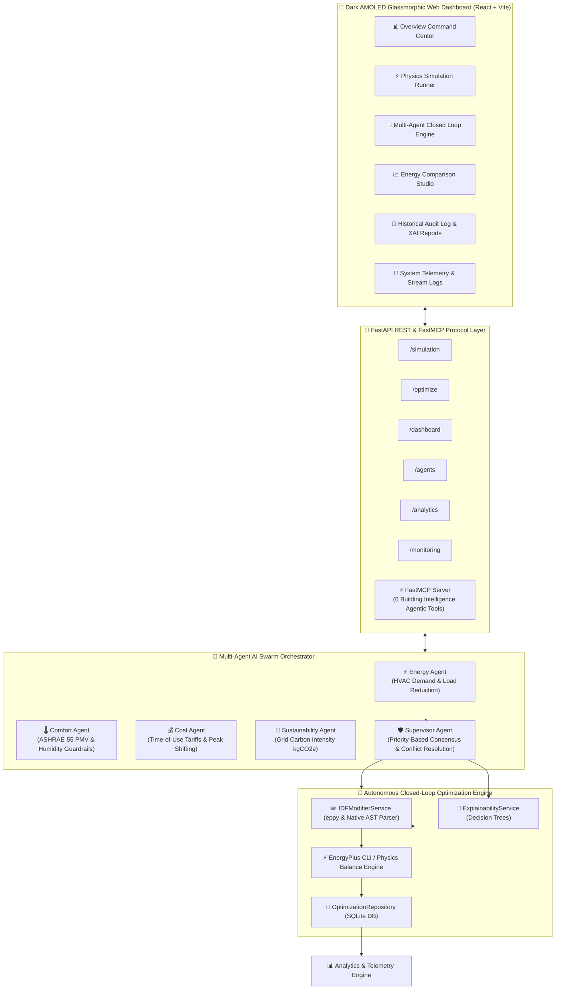

# 🌿 EcoSphere: AI-Powered Autonomous Building Energy Optimization & Multi-Agent Management System


> **EcoSphere** is an enterprise-grade, multi-agent Physical AI system designed to autonomously optimize commercial building energy efficiency, lower carbon emissions, and reduce peak electricity costs while strictly maintaining occupant thermal comfort.

By combining **physics-based EnergyPlus building simulations**, **AST-level `.idf` file modifications via `eppy`**, a **Supervisor-coordinated Multi-Agent Swarm**, **Explainable AI (XAI) reports**, a **FastMCP Server for agentic tool usage**, and a **Dark AMOLED SPA Web Dashboard**, EcoSphere provides a complete closed-loop physical AI platform.

---

## 🏛️ System Architecture



---

## 🌟 Key Platform Capabilities

### 1. 🔄 Autonomous Closed-Loop Optimization
Executes continuous optimization cycles:
$$\text{Baseline Run} \longrightarrow \text{Multi-Agent Consensus} \longrightarrow \text{AST IDF Setpoint Tuning} \longrightarrow \text{Follow-up Simulation} \longrightarrow \text{Stopping Rule Evaluation}$$
- Supports custom **Target Energy Reduction (%)** (e.g. 15%, 25%, 30%) and **Max Iterations** (e.g. 4, 5, 8 cycles).
- Monotonically scales cooling setpoints ($22.0^\circ\text{C} \rightarrow 24.5^\circ\text{C}$) and lighting density multipliers to produce real compounding energy reductions.

### 2. ⚡ Dual Physics Simulation Engine
- **EnergyPlus CLI Integration**: Directly invokes `energyplus.exe` against `.idf` building geometry and parsed `.epw` weather files.
- **Physics-Based Heat Balance Engine Fallback**: Computes thermal heat balance ($\Delta T$, COP $3.5$, direct solar radiation, and internal heat gains) when running in lightweight environments.

### 3. 🧠 Explainable AI (XAI) Reports
- Generates transparent, human-readable rationale reports for every optimization run.
- Includes specialist agent voting weights, decision trees, ASHRAE-55 PMV compliance validation, and grid carbon reduction metrics.
- Exportable as **CSV** and **JSON** audit reports.

### 4. ⚡ FastMCP Server Protocol Integration
Exposes 6 high-level agentic tools via the **FastMCP** server framework (`backend.mcp.server`):
- `run_simulation`: Execute building simulation.
- `get_latest_metrics`: Fetch latest HVAC & electricity metrics.
- `get_agent_recommendations`: Retrieve specialist agent evaluations.
- `coordinate_supervisor_plan`: Resolve agent conflicts into an approved consensus plan.
- `generate_explainability_report`: Build structured XAI decision tree reports.
- `run_closed_loop_optimization`: Execute multi-iteration closed-loop optimization runs.

### 5. 🎨 Dark AMOLED Modern SPA Dashboard
- Built with **React 18**, **Vite**, **TailwindCSS**, **Framer Motion**, and **Recharts**.
- Features Google Fonts typography (**Outfit**, **Plus Jakarta Sans**, **JetBrains Mono**).
- Includes pure pitch-black AMOLED panels (`#000000`), glassmorphism, animated multi-agent execution streams, and uniform sidebar navigation.

---

## 🤖 Multi-Agent Swarm Roles & Guardrails

| Agent Name | Role & Objective | Key Guardrails & Thresholds |
|---|---|---|
| ⚡ **Energy Agent** | Monitors HVAC load, baseline kWh, and lighting power density. Recommends setpoint adjustments to curb peak demand. | Target HVAC load reduction: 10%–25% |
| 🌡️ **Comfort Agent** | **Highest Priority Guardrail**. Enforces occupant thermal comfort constraints. Overrides energy recommendations if comfort limits are breached. | ASHRAE-55 PMV range: $[-0.5, +0.5]$, Indoor Temp: $20^\circ\text{C} - 26^\circ\text{C}$, RH: $30\% - 60\%$ |
| 💰 **Cost Agent** | Evaluates electricity tariff schedules and peak demand charges. Recommends shifting discretionary loads away from peak pricing windows. | Peak demand tariff threshold: $> \$0.25/\text{kWh}$ |
| 🌱 **Sustainability Agent** | Tracks real-time grid carbon emissions intensity ($\text{kgCO}_2\text{e}$ per kWh). Recommends load curtailment during high-emission periods. | Grid Carbon Intensity threshold: $> 0.400\text{ kgCO}_2\text{e}/\text{kWh}$ |
| 🛡️ **Supervisor Agent** | Collects all 4 specialist agent evaluations, performs priority-based conflict resolution, enforces comfort guardrails, and outputs an approved **OptimizationPlan**. | Minimum Consensus Confidence: $90\%$ |

---

## 📂 Project Directory Structure

```text
EcoSphere/
├── backend/
│   ├── config.py                 # Pydantic environment configuration
│   ├── main.py                   # FastAPI application entry point
│   ├── database/
│   │   ├── database.py           # SQLAlchemy database setup & sessions
│   │   └── models.py             # ORM models (Simulations, ClosedLoopRun, History, XAI)
│   ├── mcp/
│   │   ├── server.py             # FastMCP Server (6 agentic tools)
│   │   └── tools.py              # Tool implementation schemas
│   ├── routes/                   # FastAPI REST API endpoints
│   │   ├── agents.py
│   │   ├── analytics.py
│   │   ├── dashboard.py
│   │   ├── monitoring.py
│   │   ├── optimize.py
│   │   └── simulation.py
│   ├── schemas/                  # Typed Pydantic data schemas
│   └── services/                 # Core domain logic
│       ├── agents/               # 5 Specialist AI Agents (Energy, Comfort, Cost, Sustain, Supervisor)
│       ├── analytics_service.py  # Trend progression & export reports
│       ├── closed_loop_service.py# Multi-iteration closed-loop coordinator
│       ├── energyplus_service.py # EnergyPlus CLI & Physics Engine
│       ├── explainability_service.py # XAI decision tree generator
│       ├── idf_modifier.py       # eppy & Native AST IDF setpoint parser
│       ├── optimization_engine.py# Multi-agent orchestrator engine
│       ├── output_parser.py      # EnergyPlus CSV/HTML output parser
│       └── weather_service.py    # EPW weather file parser
├── energyplus/
│   ├── building.idf              # Commercial Test Facility IDF
│   ├── small_office.idf          # Small Office Sandbox IDF
│   └── retail.idf                # Retail Store Facility IDF
├── weather/
│   └── weather.epw               # San Francisco Intl Ap EPW weather dataset
├── frontend/
│   ├── src/
│   │   ├── components/           # Header, Sidebar, KPICard, Toast, XAIReportModal
│   │   ├── pages/                # Overview, SimulationRunner, Optimization, Comparison, History, Telemetry
│   │   ├── App.jsx
│   │   └── index.css             # AMOLED dark theme & glassmorphism utilities
│   ├── index.html
│   ├── package.json
│   ├── tailwind.config.js
│   └── vite.config.js
├── README.md
└── requirements.txt
```

---

## 📡 REST API Endpoint Reference

| Endpoint | Method | Description |
|---|---|---|
| `POST /simulation/run-path` | `POST` | Execute physics-based building energy simulation for an IDF & EPW path |
| `GET /simulation/list` | `GET` | Retrieve list of completed simulation runs |
| `GET /simulation/latest` | `GET` | Retrieve latest executed simulation record |
| `GET /agents/latest` | `GET` | Run multi-agent swarm evaluation and return Supervisor consensus plan |
| `POST /optimize/start` | `POST` | Execute autonomous closed-loop optimization session |
| `GET /optimize/history` | `GET` | Retrieve history records of closed-loop iterations |
| `GET /optimize/explanation/{id}`| `GET` | Fetch Explainable AI (XAI) rationale report for a run |
| `GET /optimize/compare` | `GET` | Compare energy metrics between baseline and optimized runs |
| `GET /dashboard/summary` | `GET` | Fetch top-level building energy KPIs and performance summary |
| `GET /analytics/run/{id}` | `GET` | Fetch multi-iteration trend progression metrics |
| `GET /analytics/export/csv/{id}`| `GET` | Download closed-loop run analytics report as CSV |
| `GET /analytics/export/json/{id}`| `GET` | Download closed-loop run analytics report as JSON |
| `GET /monitoring/logs` | `GET` | Search and filter structured agent execution logs |
| `GET /monitoring/metrics` | `GET` | Microsecond agent execution latency and call count metrics |

---

## 🚀 Local Installation & Setup

### 1. Prerequisites
- **Python 3.10+**
- **Node.js 18+** & `npm`

### 2. Backend Setup
```powershell
# Clone the repository
git clone https://github.com/shreyes-7/EcoSphere.git
cd EcoSphere

# Activate virtual environment
.\.venv\Scripts\Activate.ps1

# Install Python dependencies
pip install -r requirements.txt

# Start FastAPI backend server
uvicorn backend.main:app --reload
```
The REST API will be available at **[http://localhost:8000](http://localhost:8000)** (Interactive Docs: **[http://localhost:8000/docs](http://localhost:8000/docs)**).

### 3. FastMCP Server Setup (Optional for Agentic Tools)
```powershell
# In a separate terminal window
.\.venv\Scripts\python.exe -m backend.mcp.server
```

### 4. Frontend Setup
```powershell
# Navigate to frontend directory
cd frontend

# Install Node dependencies
npm install

# Start Vite development server
npm run dev
```
Open **[http://localhost:5173](http://localhost:5173)** in your browser to access the Dark AMOLED SPA Dashboard.

---

## 🧪 Verification & Testing

To verify the end-to-end multi-agent closed-loop optimization pipeline:

```powershell
$env:PYTHONPATH="."
.\.venv\Scripts\python.exe -c "
import urllib.request, json
data = json.dumps({'building_name': 'Commercial Test Facility', 'idf_file': 'energyplus/building.idf', 'weather_file': 'weather/weather.epw'}).encode()
req = urllib.request.Request('http://localhost:8000/simulation/run-path', data=data, headers={'Content-Type': 'application/json'})
res = json.loads(urllib.request.urlopen(req).read().decode())
print('Baseline Simulation ID:', res['id'], 'Electricity:', res['electricity'], 'kWh')
"
```

---

## 📄 License

Distributed under the **MIT License**. See `LICENSE` for details.
