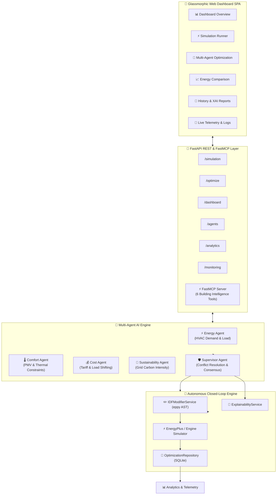

# 🌿 EcoSphere: AI-Powered Autonomous Building Energy Optimization & Multi-Agent Management System


**EcoSphere** is an enterprise-grade, multi-agent AI system designed to optimize commercial building energy efficiency, lower carbon emissions, and reduce operational costs without sacrificing occupant thermal comfort. 

By integrating **physics-based EnergyPlus building simulations**, **ast-level `.idf` modifications using `eppy`**, a **Supervisor-coordinated Multi-Agent AI architecture**, **Explainable AI (XAI)**, a **FastMCP Server for agentic tool use**, and a **modern Glassmorphism SPA Web Dashboard**, EcoSphere provides an end-to-end autonomous closed-loop optimization platform.

---

## 🏛️ System Architecture



---

## 🤖 Multi-Agent AI System Architecture

EcoSphere deploys 4 specialist recommendation agents coordinated by a Supervisor Agent:

1. **⚡ Energy Agent**: Monitors HVAC consumption, lighting power density, and baseline kWh loads. Recommends non-invasive setpoint adjustments when HVAC demand spikes.
2. **🌡️ Comfort Agent (Highest Guardrail Priority)**: Enforces occupant thermal comfort constraints based on ASHRAE-55 Predicted Mean Vote (PMV), relative humidity (30%–60%), and indoor temperature (20°C–26°C). Overrides energy-saving recommendations if comfort limits are breached.
3. **💰 Cost Agent**: Evaluates real-time electricity prices and peak demand tariffs. Recommends shifting discretionary HVAC and lighting loads away from costly operating periods.
4. **🌱 Sustainability Agent**: Monitors operational grid carbon intensity (kgCO2e per kWh). Recommends load curtailment during high-carbon grid emissions periods.
5. **🛡️ Supervisor Agent**: Collects recommendations from all 4 specialist agents, executes priority-based conflict resolution, enforces comfort guardrails, and outputs an approved **OptimizationPlan**.

---

## 🛠️ Key Features

- **🔄 Autonomous Closed-Loop Optimization**: Executes iterative optimization cycles (`Modify IDF -> Run Follow-Up Simulation -> Compare Energy Drop -> Evaluate Stopping Criteria`).
- **✏️ Automatic IDF Model Modification**: Modifies EnergyPlus `.idf` building geometry, setpoint temperatures, and schedule objects using `eppy` AST modifications.
- **🧠 Explainable AI (XAI) Reports**: Generates decision trees, confidence scores, expected savings, comfort rule compliance, and carbon impact breakdowns.
- **⚡ FastMCP Server Integration**: Exposes 6 building intelligence tools (`run_simulation`, `get_latest_metrics`, `get_agent_recommendations`, `coordinate_supervisor_plan`, `generate_explainability_report`, `run_closed_loop_optimization`) for external AI subagents.
- **📊 Historical Analytics & Report Exports**: Detailed multi-iteration progression analytics with downloadable **CSV** and **JSON** reports.
- **📡 Live Telemetry & Structured Logs**: Real-time microsecond-level latency tracking (`execution_time_ms`) and searchable JSON logs filtered by agent name or log level.

---

## 🚀 Quickstart & Local Installation

### 1. Prerequisites
- Python 3.10+
- Virtual environment (`venv` or `uv`)

### 2. Installation
```powershell
# Clone the repository
git clone https://github.com/shreyes-7/EcoSphere.git
cd EcoSphere

# Activate virtual environment
.\.venv\Scripts\Activate.ps1

# Install dependencies
pip install -r requirements.txt
```

### 3. Run Backend API & Web Dashboard
```powershell
# Launch FastAPI development server
uvicorn backend.main:app --reload
```
Open **[http://127.0.0.1:8000/app/](http://127.0.0.1:8000/app/)** in your browser to access the SPA dashboard.

### 4. Run FastMCP Building Intelligence Server
```powershell
python -m backend.mcp.server
```

---

## 📡 REST API Reference

| Endpoint | Method | Summary |
|---|---|---|
| `/simulation/run-path` | `POST` | Execute physics-based building energy simulation |
| `/agents/latest` | `GET` | Evaluate 4 specialist agents & supervisor consensus |
| `/optimize/start` | `POST` | Execute autonomous closed-loop optimization session |
| `/optimize/history` | `GET` | Retrieve historical optimization decision records |
| `/optimize/explanation/{id}` | `GET` | Generate detailed Explainable AI decision report |
| `/optimize/compare` | `GET` | Compare energy performance between simulation runs |
| `/dashboard/summary` | `GET` | Top-level building performance analytics and KPIs |
| `/analytics/run/{id}` | `GET` | Multi-iteration historical trend progression report |
| `/analytics/export/csv/{id}` | `GET` | Download closed-loop run analytics as CSV report |
| `/analytics/export/json/{id}` | `GET` | Download closed-loop run analytics as JSON report |
| `/monitoring/logs` | `GET` | Search and filter structured agent execution logs |
| `/monitoring/metrics` | `GET` | Agent execution time (ms), call counts, and latency breakdown |

---

## 🧪 Verification & Testing

To run the complete end-to-end Definition of Done pipeline verification test suite:

```powershell
$env:PYTHONPATH="."
.\.venv\Scripts\python.exe "C:\Users\Shreyes Jaiswal\.gemini\antigravity-ide\brain\cfab197a-a392-4573-a7b6-3b9c3fac07c1\scratch\test_phase12_verification.py"
```

---

## 📄 License
Distributed under the MIT License. See `LICENSE` for more information.
