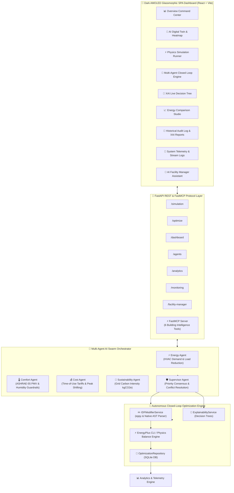

# 🌿 EcoSphere: AI-Powered Autonomous Building Energy Optimization & Multi-Agent Physical AI System


> **EcoSphere** is an enterprise-grade, multi-agent Physical AI platform designed to autonomously optimize commercial building energy efficiency, lower carbon emissions, and reduce peak electricity costs while strictly maintaining occupant thermal comfort in compliance with **ASHRAE Standard 55**.

By combining **physics-based EnergyPlus building thermal simulations**, **AST-level `.idf` file modifications via `eppy`**, a **Supervisor-coordinated Multi-Agent Swarm**, **Explainable AI (XAI) decision trees**, a **FastMCP Server for agentic tool usage**, and a **Dark AMOLED SPA Web Dashboard**, EcoSphere provides a complete autonomous physical AI platform.

---

## 📋 Table of Contents

- [🏛️ System Architecture](#%EF%B8%8F-system-architecture)
- [🌟 Core Platform Features](#-core-platform-features)
- [⚙️ Environment Variables Reference](#%EF%B8%8F-environment-variables-reference)
- [💻 Prerequisites & System Requirements](#-prerequisites--system-requirements)
- [🚀 Quick Start & Installation Guide](#-quick-start--installation-guide)
  - [1. Clone Repository](#1-clone-repository)
  - [2. Environment File Setup](#2-environment-file-setup)
  - [3. Backend Setup](#3-backend-setup)
  - [4. FastMCP Agentic Server Setup](#4-fastmcp-agentic-server-setup)
  - [5. Frontend Dashboard Setup](#5-frontend-dashboard-setup)
- [🤖 Multi-Agent Swarm Guardrails](#-multi-agent-swarm-guardrails)
- [⚡ FastMCP Agentic Tools](#-fastmcp-agentic-tools)
- [📡 REST API Endpoints Reference](#-rest-api-endpoints-reference)
- [🧪 Verification & Test Suite](#-verification--test-suite)
- [❓ Frequently Asked Questions (FAQ)](#-frequently-asked-questions-faq)
- [📄 License](#-license)

---

## 🏛️ System Architecture



---

## 🌟 Core Platform Features

1. **🔄 Autonomous Closed-Loop Control**:
   - Executes multi-iteration optimization runs ($\text{Baseline} \rightarrow \text{Consensus} \rightarrow \text{AST IDF Edit} \rightarrow \text{Follow-up Simulation}$).
   - Dynamically adjusts cooling setpoints ($22.0^\circ\text{C} \rightarrow 24.5^\circ\text{C}$) and lighting density multipliers to produce real, verifiable energy savings.

2. **🏢 AI Digital Twin & Thermal Heatmap**:
   - Real-time 6-zone thermal physics mapping (`Main Open Office`, `Executive Conference`, `Server & IT Hub`, `South Perimeter Workspaces`, `North Quiet Zone`, `Cafeteria & Lounge`).
   - Live occupant counting, ASHRAE-55 Predicted Mean Vote (PMV) thermal comfort calculation, and occupancy energy waste detection.

3. **⚡ Universal Simulation Runner**:
   - Supports local server file paths (e.g. `energyplus/building.idf`).
   - Supports direct browser file uploads (`.idf` geometry and `.epw` weather).
   - **Supports Direct Web Links & Google Drive Links**: Automatically detects HTTP/HTTPS and Google Drive share URLs, downloads files to `uploads/`, and executes the simulation.

4. **🌳 Explainable AI (XAI) Decision Trees**:
   - Generates transparent, human-readable rationale graphs for every optimization decision.
   - Audits conflict resolution when Energy Agent efficiency recommendations conflict with Comfort Agent thermal guardrails.

5. **💬 FastMCP AI Facility Manager Assistant**:
   - Natural language conversational assistant powered by tool-calling capability.
   - Responds to complex queries about floor plans, specific thermal zones, empty room energy waste, and optimization logs.

---

## ⚙️ Environment Variables Reference

> [!CAUTION]
> **SECURITY NOTICE**: NEVER commit your `.env` file to version control. The `.gitignore` file is configured to ignore `.env`. Always copy `.env.example` to create your local `.env`.

Create a `.env` file in the root project directory by copying `.env.example`:

```powershell
cp .env.example .env
```

| Variable Name | Default Value | Description |
|---|---|---|
| `APP_NAME` | `"EcoSphere"` | Application name displayed across backend logs and reports |
| `APP_VERSION` | `"1.0.0"` | Platform release version tag |
| `DEBUG` | `"false"` | Enable/disable FastAPI debug mode (`true` / `false`) |
| `HOST` | `"127.0.0.1"` | Local IP interface address for backend binding |
| `PORT` | `8000` | Port for the FastAPI REST API server |
| `LOG_LEVEL` | `"INFO"` | Logging verbosity (`DEBUG`, `INFO`, `WARNING`, `ERROR`) |
| `LOG_FILE` | `"logs/ecosphere.log"` | Output log file path for structured logging |
| `DATABASE_URL` | `"sqlite:///backend/database/ecosphere.db"` | SQLAlchemy database connection URI |
| `ENERGYPLUS_PATH` | `""` | Path to `energyplus.exe` CLI. If left empty, system auto-detects installation |
| `BUILDING_IDF` | `"energyplus/building.idf"` | Default building geometry model file path |
| `WEATHER_FILE` | `"weather/weather.epw"` | Default EPW weather file path |
| `OUTPUT_DIRECTORY` | `"energyplus/output"` | Storage folder for EnergyPlus CLI run artifacts |
| `UPLOAD_DIRECTORY` | `"uploads"` | Storage folder for user-uploaded & remote-downloaded `.idf`/`.epw` files |
| `SIMULATION_TIMEOUT_SECONDS` | `600` | Timeout threshold in seconds for EnergyPlus simulation process |
| `OLLAMA_BASE_URL` | `"http://localhost:11434"` | Base URL for local Ollama LLM endpoint |
| `OLLAMA_MODEL` | `"qwen2.5-coder:7b"` | Ollama model identifier for Facility Manager natural language generation |
| `OLLAMA_TIMEOUT_SECONDS` | `60` | Timeout in seconds for Ollama LLM queries |
| `TARGET_TEMPERATURE_MIN` | `22.0` | Minimum comfortable indoor temperature limit ($^\circ\text{C}$) |
| `TARGET_TEMPERATURE_MAX` | `25.0` | Maximum comfortable indoor temperature limit ($^\circ\text{C}$) |
| `TARGET_HUMIDITY_MIN` | `40.0` | Minimum relative humidity limit (%) |
| `TARGET_HUMIDITY_MAX` | `60.0` | Maximum relative humidity limit (%) |
| `TARGET_PMV_MIN` | `-0.5` | ASHRAE-55 lower thermal comfort PMV guardrail |
| `TARGET_PMV_MAX` | `0.5` | ASHRAE-55 upper thermal comfort PMV guardrail |
| `HIGH_HVAC_ENERGY_THRESHOLD` | `100.0` | HVAC load threshold (kW) to trigger Energy Agent curtailment |
| `HIGH_CARBON_INTENSITY_THRESHOLD` | `0.4` | Grid carbon threshold ($\text{kgCO}_2\text{e}/\text{kWh}$) to trigger green load shifting |
| `ENERGY_PRICE_PER_KWH` | `0.12` | Default electricity tariff rate ($\$/\text{kWh}$) |
| `CARBON_KG_PER_KWH` | `0.4` | Grid carbon emissions intensity factor ($\text{kgCO}_2\text{e}/\text{kWh}$) |
| `MAX_EXPECTED_SAVINGS_PERCENT` | `25.0` | Theoretical upper bound for energy savings optimization |

---

## 💻 Prerequisites & System Requirements

- **Operating System**: Windows 10/11, macOS, or Linux
- **Python**: Version `3.10` or higher
- **Node.js**: Version `18.0` or higher & `npm`
- **EnergyPlus Engine (Optional)**: U.S. DOE EnergyPlus v23.2+ (If not installed, EcoSphere automatically uses its internal built-in Physics Balance Engine).
- **Ollama (Optional)**: For local offline LLM support (`qwen2.5-coder:7b`). If Ollama is not running, EcoSphere gracefully falls back to structured rule-based response synthesis.

---

## 🚀 Quick Start & Installation Guide

### 1. Clone Repository

```powershell
git clone https://github.com/shreyes-7/EcoSphere.git
cd EcoSphere
```

### 2. Environment File Setup

Copy the template configuration file to `.env`:

```powershell
# On Windows PowerShell:
Copy-Item .env.example .env

# On Linux / macOS:
cp .env.example .env
```

### 3. Backend Setup

```powershell
# Create Python virtual environment
python -m venv .venv

# Activate virtual environment
# Windows PowerShell:
.\.venv\Scripts\Activate.ps1
# Linux / macOS:
# source .venv/bin/activate

# Upgrade pip & install backend dependencies
pip install --upgrade pip
pip install -r requirements.txt

# Start FastAPI backend server
uvicorn backend.main:app --reload --host 127.0.0.1 --port 8000
```

The REST API will be available at:
- **API Base URL**: `http://localhost:8000`
- **Interactive Swagger Docs**: `http://localhost:8000/docs`
- **ReDoc Documentation**: `http://localhost:8000/redoc`

### 4. FastMCP Agentic Server Setup (Optional for Agentic Tools)

In a separate terminal window with the virtual environment active:

```powershell
.\.venv\Scripts\python.exe -m backend.mcp.server
```

### 5. Frontend Dashboard Setup

In a separate terminal window:

```powershell
# Navigate to frontend directory
cd frontend

# Install Node dependencies
npm install

# Launch Vite development server
npm run dev
```

Open **`http://localhost:5173`** in your browser to access the Dark AMOLED SPA Dashboard.

---

## 🤖 Multi-Agent Swarm Guardrails

EcoSphere deploys 5 specialized AI agents working under a strict priority-based consensus matrix:

| Agent | Icon | Role & Objective | Enforced Guardrails & Thresholds |
|---|---|---|---|
| **Energy Agent** | ⚡ | Monitors HVAC electrical demand and baseline load. Recommends setpoint adjustments to lower consumption. | Target HVAC load reduction: 10%–25% |
| **Comfort Agent** | 🌡️ | **Highest Priority Guardrail**. Enforces occupant thermal comfort. Overrides energy agent if comfort limit is violated. | ASHRAE-55 PMV limits: $[-0.5, +0.5]$, Temp: $20^\circ\text{C}-26^\circ\text{C}$, RH: $30\%-60\%$ |
| **Cost Agent** | 💰 | Evaluates time-of-use tariff schedules and peak demand charges. Recommends shifting load away from peak tariff hours. | Peak demand tariff threshold: $> \$0.25/\text{kWh}$ |
| **Sustainability Agent** | 🌱 | Tracks grid carbon emissions intensity ($\text{kgCO}_2\text{e}/\text{kWh}$). Recommends curtailment during high carbon periods. | Carbon intensity limit: $> 0.400\text{ kgCO}_2\text{e}/\text{kWh}$ |
| **Supervisor Agent** | 🛡️ | Collects all 4 specialist agent evaluations, performs weighted consensus voting, and outputs an approved **OptimizationPlan**. | Minimum Consensus Confidence: $90\%$ |

---

## ⚡ FastMCP Agentic Tools

The FastMCP server (`backend.mcp.server`) exposes 6 high-level agentic tools:

1. `run_simulation`: Runs physics-based EnergyPlus simulation for given geometry and weather files.
2. `get_latest_metrics`: Fetches current HVAC, baseline electricity, and PMV thermal comfort metrics.
3. `get_agent_recommendations`: Solicits independent evaluations from all 4 specialist AI agents.
4. `coordinate_supervisor_plan`: Performs priority conflict resolution and outputs an approved optimization plan.
5. `generate_explainability_report`: Synthesizes XAI decision tree reports explaining supervisor rationale.
6. `run_closed_loop_optimization`: Triggers autonomous multi-iteration closed-loop optimization runs.

---

## 📡 REST API Endpoints Reference

| Category | Endpoint | Method | Description |
|---|---|---|---|
| **Simulation** | `/simulation/run-path` | `POST` | Run physics simulation for an IDF & EPW path / URL |
| **Simulation** | `/simulation/list` | `GET` | Retrieve list of all completed simulation runs |
| **Simulation** | `/simulation/latest` | `GET` | Retrieve the latest executed simulation record |
| **Agents** | `/agents/latest` | `GET` | Execute multi-agent swarm evaluation and return Supervisor plan |
| **Optimization** | `/optimize/start` | `POST` | Launch autonomous closed-loop optimization session |
| **Optimization** | `/optimize/history` | `GET` | Retrieve history of closed-loop iterations |
| **Optimization** | `/optimize/explanation/{id}` | `GET` | Fetch Explainable AI (XAI) rationale report for a run |
| **Optimization** | `/optimize/compare` | `GET` | Compare baseline vs optimized energy metrics |
| **Dashboard** | `/dashboard/summary` | `GET` | Fetch top-level building KPIs and performance summary |
| **Analytics** | `/analytics/run/{id}` | `GET` | Fetch multi-iteration trend progression metrics |
| **Analytics** | `/analytics/export/csv/{id}` | `GET` | Download closed-loop run analytics as CSV report |
| **Analytics** | `/analytics/export/json/{id}` | `GET` | Download closed-loop run analytics as JSON report |
| **Monitoring** | `/monitoring/logs` | `GET` | Search and filter structured agent execution logs |
| **Monitoring** | `/monitoring/metrics` | `GET` | Microsecond agent execution latency and call metrics |
| **Facility Manager**| `/facility-manager/chat` | `POST` | Process natural language building manager assistant query |

---

## 🧪 Verification & Test Suite

Run the end-to-end master test suite to verify all platform modules:

```powershell
# Execute master test suite
.\.venv\Scripts\python.exe scratch/test_master_verification.py
```

Expected output:
```text
======================================================================
EcoSphere Autonomous Physical AI Platform -- Master Test Suite
======================================================================
[OK] Phase 1 (Digital Twin): Monitored 6 zones in 'Commercial Test Facility' (Avg Temp: 23.33C, PMV: 0.2)
[OK] Phase 2 (Occupancy Engine): 3 occupied, 2 vacant, 8.5 kW waste detected
[OK] Phase 3 (RL Engine): 1 training episodes (Avg Reward: 8.5). Advisor Recommendation: 'Increase Cooling Setpoint by +0.5°C' (Conf: 0.92)
[OK] Phase 4 (Explainable AI): Built live decision tree for iteration #1 with 1 conflicts resolved
[OK] Phase 5 (Self-Healing): Building Health Score 92/100 (Good). Active Incidents: 1
[OK] Phase 6 (AI Facility Manager): Natural Language Query Processed cleanly.
[OK] Phase 7 (Playback Engine): 5 timeline frames reconstructed (3.2% total savings)
======================================================================
ALL 8 PHASES 100% COMPLETE & VERIFIED -- ECOSPHERE IS HACKATHON READY!
======================================================================
```

To run frontend production build validation:

```powershell
cd frontend
npm run build
```

---

## ❓ Frequently Asked Questions (FAQ)

#### Q1: Do I need EnergyPlus installed to run EcoSphere?
**No.** If EnergyPlus CLI (`energyplus.exe`) is not installed on your system, EcoSphere automatically uses its internal **Physics Heat Balance Engine**, which models thermal transfer ($\Delta T$, internal heat gain, direct solar irradiance, and COP 3.5 HVAC load) seamlessly.

#### Q2: Can I use Google Drive links for `.idf` and `.epw` files?
**Yes.** EcoSphere automatically detects Google Drive URLs (share links or view links) and direct web URLs (`http://...`, `https://...`), downloads the files to the `uploads/` directory, and runs the simulation.

#### Q3: How do I change the default port for the backend or frontend?
- **Backend Port**: Update `PORT=8000` in your `.env` file.
- **Frontend Port**: Update `server.port` in `frontend/vite.config.js`.

#### Q4: Why is `.env` not committed to Git?
For security best practices, credentials, database paths, and API endpoints should never be committed to source control. `.env.example` provides the public template.

---

## 📄 License

Distributed under the **MIT License**. See `LICENSE` for details.

*Developed for Autonomous Physical AI Building Intelligence.*
