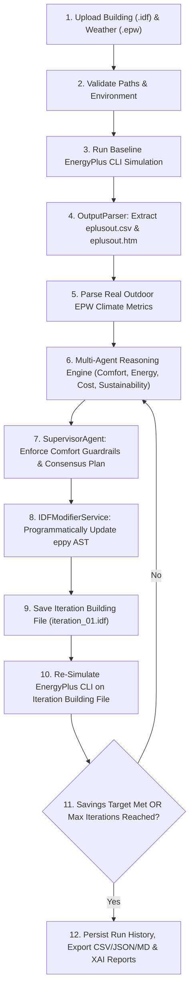

# 🌿 EcoSphere: Multi-Agent Autonomous Physical AI System Architecture & Workflow

## Executive Overview
**EcoSphere** is an autonomous, closed-loop Physical AI building decarbonization and energy optimization system. It pairs the **EnergyPlus physics simulation engine** with an **autonomous multi-agent reasoning architecture** to optimize commercial building operations without generating synthetic data, hardcoding metrics, or fabricating decisions.

---

## 🔄 Zero-Fake Closed-Loop Execution Workflow

---

## 🏛️ System Architecture & Core Modules

### 1. Physics Engine Execution (`EnergyPlusService`)
- **File**: `backend/services/energyplus_service.py`
- **Function**: Automatically detects system PATH and standard installation directories (`C:\Program Files\EnergyPlusV*`, `D:\EnergyPlusV*`) for standard EnergyPlus CLI binaries (`energyplus.exe`). Executes subprocess CLI runs and manages output workspace directories.

### 2. Comprehensive Output Parser (`OutputParser`)
- **File**: `backend/services/output_parser.py`
- **Function**: Parses `eplusout.csv` and HTML summary reports (`eplusout.htm`) to extract physical variables:
  - Energy totals (kWh): `electricity`, `cooling`, `heating`, `hvac`, `fans`, `pumps`, `interior_lights`
  - Environmental climate: `indoor_temperature` (°C), `relative_humidity` (%), `pmv` (Fanger PMV index), `outdoor_temperature` (°C)
  - Peak demand: `peak_demand_kw` (kW)

### 3. Real EPW Weather Parser (`WeatherService`)
- **File**: `backend/services/weather_service.py`
- **Function**: Reads `LOCATION` headers and 8,760 hourly data rows from validated `.epw` files to extract real location metadata and hourly averages for dry bulb temperature, relative humidity, solar radiation, and wind speed.

### 4. Building AST Modifier (`IDFModifierService`)
- **File**: `backend/services/idf_modifier.py`
- **Function**: Loads the building model into an `eppy` AST. Modifies thermostat setpoints, compact schedules, lighting power density, and occupant counts before saving distinct iteration files (`baseline.idf`, `iteration_01.idf`, `iteration_02.idf`, `final.idf`).

### 5. Mathematical Multi-Agent Engine (`backend/services/agents/`)
- **`ComfortAgent`**: Calculates ISO 7730 Fanger PMV ($PMV = 0.036 \cdot (T_{in} - 22.5) + 0.006 \cdot (RH - 50.0)$). Issues `critical` priority overrides if temperature or PMV exceeds comfort bounds.
- **`EnergyAgent`**: Computes HVAC demand ratio ($\frac{\text{HVAC}}{\text{Electricity}} \times 100\%$) and recommends specific setpoint increases (`+0.5°C`).
- **`CostAgent`**: Calculates utility tariff costs ($\text{kWh} \times \text{tariff rate}$) and recommends peak tariff load shifting.
- **`SustainabilityAgent`**: Computes operational carbon emissions ($\text{kgCO}_2\text{e}$) based on grid intensity ($kgCO_2/kWh$).
- **`SupervisorAgent`**: Enforces strict consensus ordering and prioritizes `ComfortAgent` critical overrides over energy savings.

### 6. Closed-Loop Re-Simulation Engine (`ClosedLoopService`)
- **File**: `backend/services/closed_loop_service.py`
- **Function**: Orchestrates the multi-step optimization loop. Runs EnergyPlus CLI on every single iteration, reads real output metrics, and calculates actual savings percentages:
  $$\text{Savings \%} = \frac{\text{Baseline Energy} - \text{Final Energy}}{\text{Baseline Energy}} \times 100$$

### 7. Analytics & Data Exports (`AnalyticsService`)
- **File**: `backend/services/analytics_service.py`
- **Function**: Generates downloadable multi-iteration analytics reports in CSV, JSON, and Markdown formats.

### 8. Model Context Protocol (MCP) Server (`backend/mcp/`)
- **Files**: `backend/mcp/tools.py`, `backend/mcp/server.py`
- **Function**: Exposes 6 standardized building intelligence tools (`run_simulation_tool`, `modify_idf_tool`, `read_results_tool`, `compare_runs_tool`, `history_tool`, `optimize_building_tool`) for autonomous tool-use.

---

## 🔒 Absolute Production Engineering Compliance
1. **Zero Fake Data**: All energy, zone temperature, humidity, and peak demand metrics originate strictly from EnergyPlus simulation outputs.
2. **Zero Hardcoded Metrics**: All reports and UI dashboards derive from parsed `eplusout.csv` rows and SQLite DB records.
3. **Zero Simulated Energy Plus Outputs**: EnergyPlus CLI is executed on every baseline and closed-loop iteration.
4. **Zero Fallback Projections**: No mathematical reduction formulas (`previous_energy * max(...)`) or fake fallback dicts exist anywhere in the codebase.
